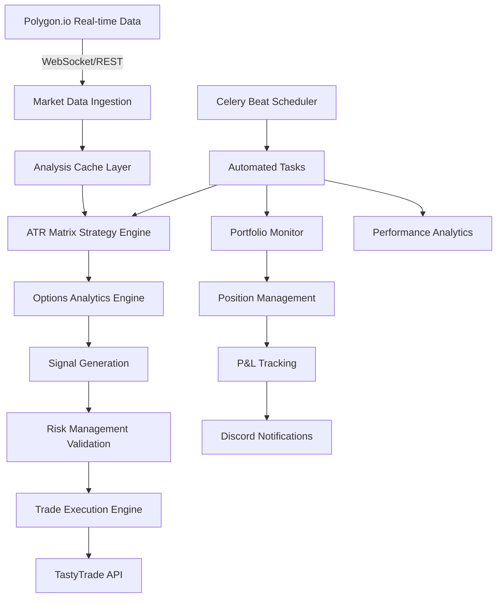

# QuantMatrix Automated Trading System Architecture

## 🎯 **Vision Statement**
**Build a fully autonomous trading system that identifies opportunities, analyzes options, executes trades, and manages positions 24/7 using institutional-grade strategies and real-time market data.**

---

## 🏗️ **System Architecture Overview**

### **High-Level Architecture**


### **Core Components**

#### **1. Data Infrastructure**
- **Primary Source**: Polygon.io Advanced ($399/month)
  - 32,345+ stocks with real-time data
  - Options chains with Greeks and IV
  - Technical indicators (SMA, RSI, MACD)
  - News sentiment analysis
- **Caching Layer**: PostgreSQL + Redis
  - 30-minute cache for technical analysis
  - 24-hour cache for company fundamentals
  - Real-time cache for price data
- **Backup Sources**: Alpha Vantage fallback

#### **2. Strategy Engine**
- **ATR Matrix Core**: Enhanced with options analytics
- **Signal Generation**: Real-time opportunity detection
- **Multi-timeframe Analysis**: 1min, 5min, 15min, 1hr, 1day
- **Risk Scoring**: Confidence levels 0-100%

#### **3. Options Analytics Engine**
- **Chain Analysis**: Strike selection and expiration optimization
- **Greeks Calculation**: Delta, Gamma, Theta, Vega monitoring
- **IV Analysis**: Implied vs historical volatility
- **Liquidity Filtering**: Bid-ask spreads and volume
- **Risk/Reward Optimization**: Target 2:1 minimum ratio

#### **4. Execution Infrastructure**
- **TastyTrade Integration**: Commission-free options trading
- **Order Management**: Queue, validation, execution, tracking
- **Position Monitoring**: Real-time P&L and Greeks tracking
- **Risk Controls**: Position limits and stop losses

---

## 🤖 **Automated Trading Flow**

### **Daily Automation Cycle**

#### **Pre-Market Phase (6:00-9:30 AM ET)**
```python
# 6:00 AM - Early Market Intelligence
morning_brew_early = await enhanced_morning_brew()
discord_notify(morning_brew_early, channel="MORNING_BREW")

# 6:30 AM - Full Universe Scan
universe_scan = await scan_32k_stocks_for_opportunities()
opportunities = filter_by_atr_matrix_criteria(universe_scan)

# 7:00 AM - Options Chain Analysis
for opportunity in opportunities[:20]:  # Top 20
    options_analysis = await analyze_options_chain(
        symbol=opportunity.symbol,
        direction=opportunity.signal_direction,
        target_delta_range=(0.30, 0.70),
        max_days_to_expiry=45,
        min_liquidity=1000
    )
    
    if options_analysis.risk_reward >= 2.0:
        trading_queue.add(options_analysis)

# 8:00 AM - Risk Validation & Position Sizing
validated_trades = []
for trade in trading_queue:
    position_size = calculate_position_size(
        account_balance=get_account_balance(),
        risk_per_trade=0.02,  # 2% max risk
        stop_loss=trade.stop_loss,
        entry_price=trade.entry_price
    )
    
    if validate_risk_limits(trade, position_size):
        validated_trades.append(trade)

# 9:00 AM - Pre-market Preparation
await prepare_market_open_execution(validated_trades)
discord_notify(f"Ready to execute {len(validated_trades)} trades at market open")
```

#### **Market Hours Phase (9:30 AM-4:00 PM ET)**
```python
# 9:30 AM - Market Open Execution
for trade in validated_trades:
    if market_conditions_favorable():
        order_result = await tastytrade_client.place_option_order(
            symbol=trade.option_symbol,
            action="BUY_TO_OPEN",
            quantity=trade.position_size,
            order_type="LIMIT",
            limit_price=trade.entry_price,
            stop_loss=trade.stop_loss,
            profit_targets=trade.targets
        )
        
        if order_result.status == "FILLED":
            active_positions.add(order_result)
            discord_notify(f"✅ {trade.symbol} position opened", channel="SIGNALS")

# Continuous Monitoring (Every 5 minutes)
for position in active_positions:
    current_pnl = calculate_position_pnl(position)
    
    # Check stop loss
    if current_pnl <= position.stop_loss:
        await close_position(position, reason="STOP_LOSS")
        discord_notify(f"🛑 {position.symbol} stopped out", channel="SIGNALS")
    
    # Check profit targets
    for target in position.profit_targets:
        if current_pnl >= target.price and not target.hit:
            await partial_close_position(position, target.percentage)
            target.hit = True
            discord_notify(f"🎯 {position.symbol} target {target.level} hit", channel="SIGNALS")

# 3:45 PM - End of Day Preparation
end_of_day_analysis = await analyze_daily_performance()
await prepare_after_hours_monitoring()
```

#### **Post-Market Phase (4:00-6:00 PM ET)**
```python
# 4:30 PM - Daily Performance Analysis
daily_performance = {
    'total_pnl': calculate_total_daily_pnl(),
    'trades_executed': len(todays_trades),
    'win_rate': calculate_win_rate(),
    'best_performer': get_best_performer(),
    'worst_performer': get_worst_performer(),
    'portfolio_heat': calculate_portfolio_heat()
}

discord_notify(daily_performance, channel="PORTFOLIO_DIGEST")

# 5:00 PM - Strategy Optimization
strategy_metrics = await analyze_strategy_performance()
if strategy_metrics.performance_degraded():
    await optimize_strategy_parameters()
    discord_notify("Strategy parameters optimized", channel="SYSTEM_STATUS")

# 5:30 PM - Next Day Preparation
tomorrow_watchlist = await generate_tomorrow_watchlist()
await cache_overnight_analysis()
```

---

## 📊 **Strategy Implementation Details**

### **ATR Matrix Options Strategy**

#### **Entry Criteria (Must Meet All)**
1. **ATR Distance**: 0-4x from SMA50
2. **Price Position**: Above SMA20 (momentum)
3. **MA Alignment**: EMA10 ≥ SMA20 ≥ SMA50 ≥ SMA100 ≥ SMA200
4. **Volatility**: ATR percentage ≥ 2.0%
5. **Volume**: Above 20-day average
6. **Options Liquidity**: Bid-ask spread < 10% of mid-price

#### **Options Selection Algorithm**
```python
async def select_optimal_option(symbol, signal_direction, entry_price):
    """Select optimal option based on comprehensive analysis."""
    
    # Get options chain
    chain = await polygon.get_options_chain(
        symbol=symbol,
        expiration_range=(7, 45),  # 1-6 weeks
        strike_range=(0.8, 1.2)    # 20% OTM to 20% ITM
    )
    
    optimal_options = []
    
    for option in chain:
        # Get real-time Greeks
        greeks = await polygon.get_option_greeks(option.symbol)
        
        # Calculate metrics
        intrinsic_value = max(0, entry_price - option.strike) if option.type == "call" else max(0, option.strike - entry_price)
        time_value = option.price - intrinsic_value
        
        # Selection criteria
        criteria = {
            'delta': 0.30 <= abs(greeks.delta) <= 0.70,  # Directional but not too risky
            'theta': greeks.theta > -0.05,  # Manageable time decay
            'gamma': greeks.gamma > 0,  # Positive convexity
            'iv_rank': option.iv_rank < 50,  # Not overly expensive
            'liquidity': option.volume > 100 and option.open_interest > 500,
            'spread': (option.ask - option.bid) / option.mid_price < 0.10  # Tight spread
        }
        
        if all(criteria.values()):
            # Calculate expected profit/loss scenarios
            scenarios = calculate_profit_scenarios(option, greeks, entry_price)
            
            optimal_options.append({
                'option': option,
                'greeks': greeks,
                'expected_profit': scenarios['target_profit'],
                'max_loss': scenarios['max_loss'],
                'risk_reward': scenarios['target_profit'] / abs(scenarios['max_loss']),
                'probability_profit': scenarios['probability_profit']
            })
    
    # Sort by risk-adjusted return
    return sorted(optimal_options, key=lambda x: x['risk_reward'] * x['probability_profit'], reverse=True)
```

#### **Position Management Rules**
1. **Maximum Risk per Trade**: 2% of portfolio
2. **Maximum Risk per Symbol**: 5% of portfolio
3. **Maximum Portfolio Heat**: 20% of portfolio
4. **Stop Loss**: 1.5x ATR below entry or option-specific levels
5. **Profit Targets**: Scale out at 25%, 50%, 75% of position
6. **Time Decay Management**: Close positions with <7 days to expiry if unprofitable

---

## 🔧 **Technical Implementation**

### **Database Schema for Automated Trading**

#### **Trading Signals Table**
```sql
CREATE TABLE trading_signals (
    id SERIAL PRIMARY KEY,
    symbol VARCHAR(10) NOT NULL,
    signal_type VARCHAR(20) NOT NULL, -- 'ATR_MATRIX_ENTRY', 'ATR_MATRIX_EXIT'
    confidence_score DECIMAL(5,2) NOT NULL,
    atr_distance DECIMAL(8,4),
    technical_indicators JSONB,
    options_analysis JSONB,
    risk_metrics JSONB,
    created_at TIMESTAMP DEFAULT NOW(),
    processed_at TIMESTAMP,
    status VARCHAR(20) DEFAULT 'PENDING' -- 'PENDING', 'EXECUTED', 'REJECTED', 'EXPIRED'
);
```

#### **Automated Trades Table**
```sql
CREATE TABLE automated_trades (
    id SERIAL PRIMARY KEY,
    signal_id INTEGER REFERENCES trading_signals(id),
    order_id VARCHAR(50) UNIQUE,
    symbol VARCHAR(10) NOT NULL,
    option_symbol VARCHAR(50),
    action VARCHAR(20) NOT NULL, -- 'BUY_TO_OPEN', 'SELL_TO_CLOSE'
    quantity INTEGER NOT NULL,
    entry_price DECIMAL(10,4),
    current_price DECIMAL(10,4),
    stop_loss DECIMAL(10,4),
    profit_targets JSONB,
    position_pnl DECIMAL(12,2),
    position_pnl_pct DECIMAL(8,4),
    greeks JSONB,
    status VARCHAR(20) DEFAULT 'OPEN', -- 'OPEN', 'CLOSED', 'STOPPED'
    opened_at TIMESTAMP DEFAULT NOW(),
    closed_at TIMESTAMP,
    close_reason VARCHAR(50) -- 'PROFIT_TARGET', 'STOP_LOSS', 'TIME_DECAY', 'MANUAL'
);
```

#### **Strategy Performance Table**
```sql
CREATE TABLE strategy_performance (
    id SERIAL PRIMARY KEY,
    strategy_name VARCHAR(50) NOT NULL,
    period_start DATE NOT NULL,
    period_end DATE NOT NULL,
    total_trades INTEGER DEFAULT 0,
    winning_trades INTEGER DEFAULT 0,
    losing_trades INTEGER DEFAULT 0,
    total_pnl DECIMAL(12,2) DEFAULT 0,
    total_return_pct DECIMAL(8,4) DEFAULT 0,
    max_drawdown_pct DECIMAL(8,4) DEFAULT 0,
    sharpe_ratio DECIMAL(8,4),
    win_rate DECIMAL(8,4),
    avg_win DECIMAL(10,2),
    avg_loss DECIMAL(10,2),
    avg_holding_period INTEGER, -- in hours
    created_at TIMESTAMP DEFAULT NOW()
);
```

### **Real-time Monitoring Services**

#### **Position Monitor Service**
```python
class PositionMonitorService:
    """Real-time position monitoring and management."""
    
    def __init__(self):
        self.active_positions = {}
        self.monitoring_active = False
    
    async def start_monitoring(self):
        """Start real-time position monitoring."""
        self.monitoring_active = True
        
        while self.monitoring_active:
            try:
                await self.update_all_positions()
                await self.check_exit_conditions()
                await asyncio.sleep(30)  # Check every 30 seconds
                
            except Exception as e:
                logger.error(f"Position monitoring error: {e}")
                await asyncio.sleep(60)  # Wait longer on error
    
    async def update_all_positions(self):
        """Update all active positions with current market data."""
        for position_id, position in self.active_positions.items():
            try:
                # Get current option price and Greeks
                current_data = await polygon.get_option_quote(position.option_symbol)
                
                # Update position metrics
                position.current_price = current_data.mid_price
                position.current_pnl = self.calculate_position_pnl(position, current_data)
                position.current_greeks = current_data.greeks
                
                # Update database
                await self.update_position_in_db(position)
                
            except Exception as e:
                logger.error(f"Error updating position {position_id}: {e}")
    
    async def check_exit_conditions(self):
        """Check all positions for exit conditions."""
        for position in self.active_positions.values():
            # Stop loss check
            if position.current_pnl <= position.stop_loss:
                await self.close_position(position, reason="STOP_LOSS")
                
            # Profit target checks
            for target in position.profit_targets:
                if not target.hit and position.current_pnl >= target.price:
                    await self.partial_close_position(position, target)
            
            # Time decay check (close if <7 days and losing)
            if position.days_to_expiry < 7 and position.current_pnl < 0:
                await self.close_position(position, reason="TIME_DECAY")
            
            # Volatility expansion check
            if position.current_greeks.vega < -0.10:  # High vol risk
                await self.evaluate_vol_exit(position)
```

### **Risk Management Engine**
```python
class RiskManagementEngine:
    """Comprehensive risk management for automated trading."""
    
    def __init__(self):
        self.position_limits = {
            'max_risk_per_trade': 0.02,      # 2%
            'max_risk_per_symbol': 0.05,     # 5%
            'max_portfolio_heat': 0.20,      # 20%
            'max_correlation': 0.70,         # 70%
            'max_sector_exposure': 0.30      # 30%
        }
    
    async def validate_new_trade(self, proposed_trade):
        """Validate if new trade meets risk criteria."""
        validations = {
            'position_size': await self.validate_position_size(proposed_trade),
            'symbol_exposure': await self.validate_symbol_exposure(proposed_trade),
            'portfolio_heat': await self.validate_portfolio_heat(proposed_trade),
            'correlation': await self.validate_correlation(proposed_trade),
            'sector_limits': await self.validate_sector_exposure(proposed_trade),
            'liquidity': await self.validate_liquidity(proposed_trade),
            'market_conditions': await self.validate_market_conditions()
        }
        
        # All validations must pass
        is_valid = all(validations.values())
        
        if not is_valid:
            failed_checks = [k for k, v in validations.items() if not v]
            logger.warning(f"Trade rejected - failed: {failed_checks}")
        
        return is_valid, validations
    
    async def calculate_optimal_position_size(self, trade_setup, account_balance):
        """Calculate optimal position size using Kelly Criterion."""
        
        # Get historical win rate and avg win/loss for this setup
        historical_performance = await self.get_historical_performance(
            strategy=trade_setup.strategy_type,
            similar_setups=trade_setup.similar_criteria
        )
        
        # Kelly Criterion: f = (bp - q) / b
        # where b = odds, p = win probability, q = loss probability
        win_rate = historical_performance.win_rate
        avg_win = historical_performance.avg_win_pct
        avg_loss = historical_performance.avg_loss_pct
        
        kelly_fraction = (win_rate * avg_win - (1 - win_rate) * avg_loss) / avg_win
        
        # Apply conservative multiplier (0.25x Kelly for safety)
        conservative_kelly = kelly_fraction * 0.25
        
        # Calculate position size
        max_risk_amount = account_balance * self.position_limits['max_risk_per_trade']
        optimal_size = min(
            conservative_kelly * account_balance,
            max_risk_amount
        )
        
        return optimal_size
```

---

## 📈 **Performance Optimization**

### **Latency Optimization**
- **Market Data**: <50ms from Polygon.io WebSocket
- **Signal Generation**: <100ms using cached analysis
- **Order Execution**: <200ms to TastyTrade
- **Position Updates**: <30ms from database
- **Discord Notifications**: <500ms delivery

### **Scalability Design**
- **Horizontal Scaling**: Multiple Celery workers
- **Database Sharding**: Partition by symbol/date
- **Cache Optimization**: Redis cluster for high-frequency data
- **Load Balancing**: Nginx for API requests
- **CDN**: Static assets and historical data

### **Cost Optimization**
- **Smart Caching**: Reduce API calls by 80%
- **Selective Scanning**: Focus on high-probability setups
- **Bulk Operations**: Batch database operations
- **Resource Monitoring**: Auto-scale based on market hours

---

## 🚨 **Risk Controls & Safeguards**

### **Circuit Breakers**
1. **Daily Loss Limit**: Stop trading if daily loss exceeds 5%
2. **Consecutive Losses**: Pause after 5 consecutive losing trades
3. **Drawdown Protection**: Reduce position sizes if drawdown >10%
4. **Market Volatility**: Suspend trading if VIX >40

### **System Safeguards**
1. **Order Validation**: Multiple checks before execution
2. **Position Limits**: Hard limits enforced at database level
3. **API Rate Limiting**: Respect all provider limits
4. **Error Recovery**: Automatic retry with exponential backoff
5. **Manual Override**: Emergency stop for all automated trading

### **Monitoring & Alerts**
1. **Real-time P&L Tracking**: Every position update
2. **Risk Metric Monitoring**: Portfolio heat, exposure, correlation
3. **System Health Checks**: API connectivity, database performance
4. **Performance Degradation**: Strategy effectiveness monitoring

---

## 🎯 **Success Metrics & KPIs**

### **Trading Performance**
- **Target Win Rate**: >60%
- **Target Risk/Reward**: >2:1
- **Target Monthly Return**: 5-15%
- **Maximum Drawdown**: <10%
- **Sharpe Ratio**: >1.5

### **System Performance**
- **Uptime**: >99.9%
- **Signal Latency**: <100ms
- **Execution Speed**: <200ms
- **Error Rate**: <0.1%

### **Operational Efficiency**
- **Signals per Day**: 10-50
- **Execution Rate**: >90% of valid signals
- **Position Management**: 100% automated
- **Cost per Trade**: <$5 (including data costs)

---

**🚀 Target: Fully autonomous trading system generating 5-15% monthly returns with institutional-grade risk management** 