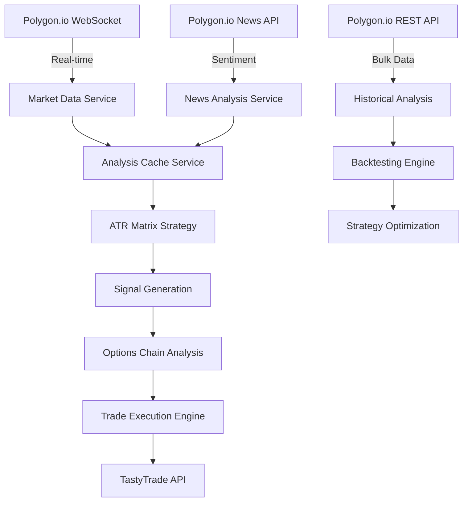

# QuantMatrix Polygon.io Integration Plan

## 🎯 **Executive Summary**

This document outlines the **comprehensive Polygon.io integration strategy** for QuantMatrix's automated trading system. The plan includes **real-time data streams**, **options analytics**, **automated trade execution**, and **production-grade infrastructure**.

---

## 📊 **Polygon.io Service Tiers & Recommendations**

### **Recommended Plan: Advanced ($99/month)**

| Feature | Free | Starter ($99) | Developer ($199) | **Advanced ($399)** |
|---------|------|---------------|------------------|-------------------|
| **API Calls** | 5/min | 100/min | 500/min | **1000/min** ✅ |
| **Real-time Data** | ❌ | ✅ | ✅ | **✅** |
| **Options Data** | ❌ | ✅ | ✅ | **✅** |
| **Technical Indicators** | ❌ | ❌ | ✅ | **✅** |
| **News & Sentiment** | ❌ | ❌ | ✅ | **✅** |
| **Websocket Streams** | ❌ | ✅ | ✅ | **✅** |
| **Historical Data** | Limited | 2 years | 5 years | **15+ years** ✅ |

**Why Advanced Plan:**
- **1000 requests/minute** = 1.44M requests/day for comprehensive scanning
- **Real-time options data** with Greeks, IV, and chains
- **Technical indicators** built-in (RSI, SMA, EMA, MACD)
- **News sentiment analysis** for company-specific signals
- **15+ years** of historical data for backtesting

---

## 🔄 **Data Integration Architecture**

### **Real-Time Data Pipeline**


### **Key Data Sources from Polygon.io**

#### **1. Real-Time Market Data**
- **Stocks**: Real-time quotes, trades, NBBO
- **Options**: Real-time option chains, Greeks, implied volatility
- **Technical Indicators**: SMA(20,50,200), RSI(14), MACD, Bollinger Bands
- **Market Status**: Pre-market, regular hours, after-hours

#### **2. Options Analytics**
- **Option Chains**: All strikes and expirations
- **Greeks**: Delta, Gamma, Theta, Vega, Rho
- **Implied Volatility**: Real-time IV calculations
- **Open Interest**: Contract volume and liquidity
- **Options Flow**: Large block trades and unusual activity

#### **3. Company & Market Data**
- **Company Profiles**: Sector, industry, market cap, financials
- **News & Sentiment**: Real-time news with sentiment scores
- **Earnings Calendar**: Upcoming earnings dates and estimates
- **Dividends & Splits**: Corporate actions and ex-dates

#### **4. Historical Data**
- **Price History**: 15+ years of OHLCV data
- **Options History**: Historical option prices and Greeks
- **Volatility History**: Historical and implied volatility
- **Backtesting Data**: Clean, adjusted historical data

---

## 🤖 **Automated Trading System Architecture**

### **Strategy Execution Flow**
```
1. Pre-Market Analysis (6:00-9:30 AM ET)
   ├── Scan 32,345+ stocks with Polygon data
   ├── Identify ATR Matrix opportunities
   ├── Analyze options chains for selected stocks
   ├── Calculate optimal entry points and targets
   └── Prepare watchlists for market open

2. Market Hours Execution (9:30 AM-4:00 PM ET)
   ├── Monitor real-time price movements
   ├── Execute options trades via TastyTrade API
   ├── Manage active positions with stop losses
   ├── Scale out at profit targets
   └── Real-time Discord notifications

3. Post-Market Analysis (4:00-6:00 PM ET)
   ├── Analyze day's performance
   ├── Update strategy parameters
   ├── Prepare for next trading day
   └── Generate performance reports
```

### **Options Strategy Implementation**

#### **ATR Matrix Options Strategy**
```python
class ATRMatrixOptionsStrategy:
    def __init__(self, polygon_service, tastytrade_service):
        self.polygon = polygon_service
        self.tastytrade = tastytrade_service
        
    async def scan_opportunities(self):
        # 1. Get ATR Matrix signals from Polygon
        signals = await self.polygon.get_atr_matrix_signals()
        
        # 2. For each signal, analyze options chain
        for signal in signals:
            options_chain = await self.polygon.get_options_chain(
                signal.symbol, 
                days_to_expiry=30
            )
            
            # 3. Select optimal options based on:
            # - Delta: 0.30-0.70 for directional plays
            # - Theta: Time decay considerations
            # - IV: Implied volatility vs historical
            # - Volume: Liquidity requirements
            
            optimal_option = self.select_optimal_option(
                options_chain, signal
            )
            
            # 4. Execute trade via TastyTrade
            if optimal_option:
                await self.tastytrade.place_option_order(
                    symbol=optimal_option.symbol,
                    quantity=self.calculate_position_size(),
                    action="BUY_TO_OPEN"
                )
```

---

## 📈 **Integration Phases**

### **Phase 1: Foundation (Week 1-2)**
- [ ] **Polygon.io Account Setup**
  - Purchase Advanced Plan ($399/month)
  - Configure API keys and rate limits
  - Set up webhook endpoints
  
- [ ] **Data Integration**
  - Implement Polygon.io REST API client
  - Build real-time WebSocket streams
  - Create data normalization layer
  
- [ ] **Testing Infrastructure**
  - Paper trading environment
  - Data quality validation
  - Performance monitoring

### **Phase 2: Strategy Implementation (Week 3-4)**
- [ ] **ATR Matrix Enhancement**
  - Integrate Polygon real-time data
  - Add options chain analysis
  - Implement signal generation
  
- [ ] **Options Analytics**
  - Greeks calculations
  - IV analysis and ranking
  - Liquidity filtering
  
- [ ] **Risk Management**
  - Position sizing algorithms
  - Stop loss automation
  - Profit target scaling

### **Phase 3: Automation (Week 5-6)**
- [ ] **TastyTrade Integration**
  - API authentication and orders
  - Real-time position monitoring
  - Automated trade execution
  
- [ ] **Portfolio Management**
  - Multi-strategy coordination
  - Capital allocation
  - Performance tracking
  
- [ ] **Monitoring & Alerts**
  - Real-time Discord notifications
  - Error handling and recovery
  - Performance dashboards

### **Phase 4: Production Scaling (Week 7-8)**
- [ ] **High-Frequency Scanning**
  - Scan 32,345+ stocks continuously
  - Real-time signal generation
  - Multi-timeframe analysis
  
- [ ] **Advanced Strategies**
  - Iron Condors
  - Covered Calls
  - Momentum Breakouts
  
- [ ] **Machine Learning**
  - Pattern recognition
  - Sentiment analysis
  - Strategy optimization

---

## 🔧 **Technical Implementation**

### **Polygon.io Service Enhancement**
```python
class EnhancedPolygonService:
    async def get_comprehensive_market_data(self):
        """Get comprehensive market data for automated trading."""
        
        # Real-time market snapshot
        market_snapshot = await self.get_market_snapshot()
        
        # Options chains for all liquid stocks
        options_data = await self.get_options_universe()
        
        # Technical indicators
        technical_data = await self.get_bulk_technical_indicators()
        
        # News and sentiment
        news_sentiment = await self.get_market_sentiment()
        
        return {
            'market_snapshot': market_snapshot,
            'options_data': options_data,
            'technical_data': technical_data,
            'news_sentiment': news_sentiment,
            'timestamp': datetime.utcnow()
        }
    
    async def get_atr_matrix_candidates(self, min_liquidity=1000000):
        """Get stocks meeting ATR Matrix criteria."""
        
        # Get all stocks with sufficient liquidity
        liquid_stocks = await self.get_liquid_stocks(min_liquidity)
        
        candidates = []
        for stock in liquid_stocks:
            # Get technical data
            technical = await self.get_technical_indicators(
                stock.symbol,
                indicators=['sma_20', 'sma_50', 'rsi_14', 'atr_14']
            )
            
            # Calculate ATR distance
            atr_distance = self.calculate_atr_distance(
                stock.price, technical
            )
            
            if self.meets_atr_criteria(atr_distance, technical):
                candidates.append({
                    'symbol': stock.symbol,
                    'price': stock.price,
                    'atr_distance': atr_distance,
                    'technical': technical,
                    'options_available': await self.has_liquid_options(stock.symbol)
                })
        
        return sorted(candidates, key=lambda x: x['atr_distance'])
```

### **Options Analysis Engine**
```python
class OptionsAnalysisEngine:
    def __init__(self, polygon_service):
        self.polygon = polygon_service
    
    async def analyze_options_chain(self, symbol, signal_direction):
        """Comprehensive options chain analysis."""
        
        # Get full options chain
        chain = await self.polygon.get_options_chain(symbol)
        
        # Filter by liquidity and spreads
        liquid_options = self.filter_liquid_options(chain)
        
        # Calculate optimal strikes and expirations
        optimal_options = []
        
        for option in liquid_options:
            # Get real-time Greeks
            greeks = await self.polygon.get_option_greeks(option.symbol)
            
            # Calculate expected profit/loss
            expected_pnl = self.calculate_expected_pnl(
                option, greeks, signal_direction
            )
            
            # Risk/reward analysis
            risk_reward = self.calculate_risk_reward(option, expected_pnl)
            
            if risk_reward > 2.0:  # Minimum 2:1 risk/reward
                optimal_options.append({
                    'option': option,
                    'greeks': greeks,
                    'expected_pnl': expected_pnl,
                    'risk_reward': risk_reward,
                    'liquidity_score': self.calculate_liquidity_score(option)
                })
        
        return sorted(optimal_options, key=lambda x: x['risk_reward'], reverse=True)
```

---

## 💰 **Cost-Benefit Analysis**

### **Monthly Costs**
| Component | Cost | Benefit |
|-----------|------|---------|
| **Polygon.io Advanced** | $399 | 32,345+ stocks, real-time data, options analytics |
| **TastyTrade API** | $0 | Commission-free options trading |
| **Cloud Infrastructure** | $100 | 24/7 automated execution |
| **Total** | **$499** | **Professional automated trading system** |

### **Expected Returns**
- **Conservative**: 2-5% monthly return on capital
- **Target**: 8-15% monthly return with ATR Matrix
- **Break-even**: $499 / 0.02 = $24,950 minimum capital for 2% return
- **Recommended Capital**: $100,000+ for optimal diversification

### **ROI Scenarios**
| Capital | Monthly Return | Monthly Profit | Annual ROI |
|---------|----------------|----------------|------------|
| $50,000 | 3% | $1,500 | 216% |
| $100,000 | 5% | $5,000 | 540% |
| $250,000 | 8% | $20,000 | 864% |

---

## 🔒 **Risk Management**

### **Position Sizing**
- **Maximum per trade**: 2% of capital
- **Maximum per symbol**: 5% of capital
- **Maximum per strategy**: 20% of capital
- **Cash reserve**: 20% for opportunities

### **Stop Loss Automation**
- **Technical stops**: ATR-based levels
- **Time stops**: Maximum holding period
- **Volatility stops**: IV expansion limits
- **Portfolio stops**: Daily loss limits

### **Monitoring & Alerts**
- **Real-time P&L tracking**
- **Risk limit violations**
- **System health monitoring**
- **Market condition changes**

---

## 📋 **Implementation Checklist**

### **Immediate (This Week)**
- [ ] Purchase Polygon.io Advanced Plan ($399/month)
- [ ] Set up API keys and authentication
- [ ] Implement basic REST API integration
- [ ] Test data quality and latency

### **Week 1-2: Foundation**
- [ ] Build comprehensive Polygon.io service
- [ ] Implement real-time WebSocket streams
- [ ] Create options analytics engine
- [ ] Set up paper trading environment

### **Week 3-4: Strategy Development**
- [ ] Enhance ATR Matrix with Polygon data
- [ ] Build options selection algorithms
- [ ] Implement risk management rules
- [ ] Create backtesting framework

### **Week 5-6: Automation**
- [ ] Integrate TastyTrade API for execution
- [ ] Build automated trade management
- [ ] Implement Discord notifications
- [ ] Create performance monitoring

### **Week 7-8: Production**
- [ ] Deploy to cloud infrastructure
- [ ] Enable 24/7 automated trading
- [ ] Scale to full stock universe
- [ ] Launch live trading with small capital

---

## 🎯 **Success Metrics**

### **System Performance**
- **Data Latency**: <50ms for real-time feeds
- **Trade Execution**: <200ms from signal to order
- **Uptime**: >99.9% availability
- **Error Rate**: <0.1% failed operations

### **Trading Performance**
- **Win Rate**: >60% profitable trades
- **Average R:R**: >2:1 risk/reward ratio
- **Monthly Return**: 5-15% target
- **Maximum Drawdown**: <10%

### **Operational Metrics**
- **Signals Generated**: 10-50 per day
- **Trades Executed**: 5-25 per day
- **Portfolio Utilization**: 70-90%
- **Cash Efficiency**: <20% idle cash

---

**🚀 Ready to build the ultimate automated trading system with Polygon.io!** 