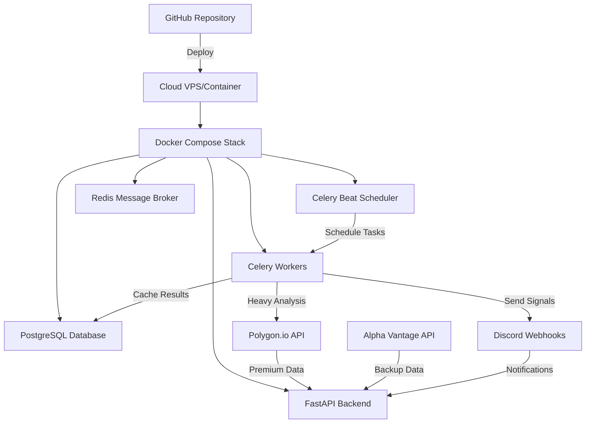

# QuantMatrix Production Scheduling Plan

## 🎯 **Executive Summary**

This document outlines the **production-level scheduling strategy** for QuantMatrix's comprehensive market analysis system. The plan includes **heavy analysis with caching**, **Celery Beat scheduling**, **cloud deployment options**, and **scaling strategies**.

---

## 📅 **Comprehensive Scheduling Matrix**

### **Pre-Market (6:00 AM - 9:30 AM ET)**

| Time (ET) | Task | Description | Frequency | Cache Duration |
|-----------|------|-------------|-----------|----------------|
| **6:00 AM** | `morning-brew-early` | Comprehensive market intelligence with overnight news | Daily | 4 hours |
| **6:30 AM** | `pre-market-scan` | Full universe ATR scan with pre-market data | Daily | 30 minutes |
| **7:00 AM** | `portfolio-sync-morning` | IBKR/TastyTrade account sync and tax lots | Daily | 24 hours |
| **7:30 AM** | `morning-brew-main` | **HEAVY ANALYSIS** - 508+ stock scan with comprehensive company analysis | Daily | 6 hours |
| **8:00 AM** | `earnings-alerts` | Companies reporting earnings today | Daily | 24 hours |
| **8:30 AM** | `economic-calendar-sync` | Sync day's economic events | Daily | 24 hours |
| **9:00 AM** | `pre-market-signals` | Entry signals based on pre-market movement | Daily | 15 minutes |

### **Market Hours (9:30 AM - 4:00 PM ET)**

| Time (ET) | Task | Description | Frequency | Cache Duration |
|-----------|------|-------------|-----------|----------------|
| **9:45 AM** | `opening-scan` | **HEAVY ANALYSIS** - Full ATR scan with comprehensive analysis | Daily | 30 minutes |
| **10:15 AM** | `portfolio-alerts-check` | Check portfolio positions for alerts | Every 15 min | 5 minutes |
| **11:00 AM** | `mid-morning-signals` | **HEAVY ANALYSIS** - Comprehensive signals with company data | Daily | 1 hour |
| **12:00 PM** | `midday-portfolio-digest` | Portfolio performance summary | Daily | 2 hours |
| **1:00 PM** | `afternoon-scan` | **HEAVY ANALYSIS** - Full universe scan with news sentiment | Daily | 30 minutes |
| **2:30 PM** | `late-day-signals` | Final entry opportunities | Daily | 30 minutes |
| **3:45 PM** | `closing-scan` | **HEAVY ANALYSIS** - End-of-day opportunities | Daily | 1 hour |

### **Post-Market (4:00 PM - 6:00 PM ET)**

| Time (ET) | Task | Description | Frequency | Cache Duration |
|-----------|------|-------------|-----------|----------------|
| **4:15 PM** | `closing-portfolio-sync` | Final portfolio sync of the day | Daily | 2 hours |
| **4:30 PM** | `daily-portfolio-digest` | **HEAVY ANALYSIS** - Comprehensive daily summary | Daily | 24 hours |
| **5:00 PM** | `post-market-analysis` | After-hours movement analysis | Daily | 2 hours |
| **5:30 PM** | `next-day-prep` | Prepare watchlists for tomorrow | Daily | 18 hours |

### **Evening & Overnight (6:00 PM - 6:00 AM ET)**

| Time (ET) | Task | Description | Frequency | Cache Duration |
|-----------|------|-------------|-----------|----------------|
| **6:00 PM** | `evening-news-sync` | **HEAVY ANALYSIS** - Comprehensive news analysis | Daily | 12 hours |
| **8:00 PM** | `international-markets` | Global market analysis | Daily | 8 hours |
| **10:00 PM** | `database-cleanup` | Clean expired cache and optimize | Daily | - |
| **12:00 AM** | `overnight-sync` | International data sync | Daily | 6 hours |
| **2:00 AM** | `system-maintenance` | Database maintenance and backups | Daily | - |
| **4:00 AM** | `pre-market-prep` | Prepare for pre-market analysis | Daily | 2 hours |

### **Weekly & Monthly Tasks**

| Schedule | Task | Description | Cache Duration |
|----------|------|-------------|----------------|
| **Sunday 8:00 AM** | `weekly-performance-report` | **HEAVY ANALYSIS** - Comprehensive weekly analysis | 7 days |
| **Sunday 9:00 AM** | `stock-universe-update` | Update and expand stock universe | 7 days |
| **Sunday 10:00 AM** | `strategy-performance-review` | Analyze strategy effectiveness | 7 days |
| **1st of month 2:00 AM** | `monthly-cleanup` | Archive old data, performance optimization | - |
| **1st of month 3:00 AM** | `polygon-usage-analysis` | Analyze API usage and costs | 30 days |

---

## 🔧 **Technology Stack & Implementation**

### **Current System (Local Development)**
```bash
# Celery Beat (already implemented)
celery -A backend.tasks.celery_app beat --loglevel=info

# Celery Workers
celery -A backend.tasks.celery_app worker --loglevel=info

# Redis (message broker)
redis-server

# PostgreSQL (data storage)
postgresql
```

### **Production Deployment Options**

#### **Option 1: Cloud VPS (Recommended for start)**
- **Provider:** DigitalOcean, Linode, or AWS EC2
- **Cost:** $40-80/month for robust instance
- **Benefits:** Full control, easy Docker deployment
- **Celery:** Use Redis/PostgreSQL on same instance
- **Monitoring:** Basic server monitoring

#### **Option 2: Containerized Cloud (Scalable)**
- **Provider:** AWS ECS, Google Cloud Run, or Azure Container Instances
- **Cost:** $60-150/month depending on usage
- **Benefits:** Auto-scaling, managed infrastructure
- **Celery:** Use managed Redis (AWS ElastiCache)
- **Monitoring:** Cloud-native monitoring

#### **Option 3: Serverless Hybrid (Advanced)**
- **Functions:** AWS Lambda for individual tasks
- **Scheduler:** AWS EventBridge for cron jobs
- **Cost:** $20-100/month based on usage
- **Benefits:** Pay-per-execution, infinite scale
- **Monitoring:** AWS CloudWatch

### **Recommended Production Architecture**



---

## 💾 **Data Caching Strategy**

### **Cache Hierarchy**
1. **Redis** (15-minute fast cache) - Real-time prices, technical indicators
2. **PostgreSQL** (30min-24hr cache) - Analysis results, company data
3. **File Cache** (1-7 days) - Historical data, static reference data

### **Cache Invalidation Rules**
- **Market Open/Close:** Invalidate all price-dependent cache
- **News Events:** Invalidate company-specific analysis
- **Earnings Reports:** Invalidate fundamental analysis
- **Manual Override:** API endpoint to force cache refresh

### **Heavy Analysis Optimization**
```python
# Cache-First Approach
async def get_comprehensive_analysis(symbol: str):
    # 1. Check cache first
    cached = analysis_cache_service.get_cached_analysis(symbol, 'comprehensive')
    if cached:
        return cached
    
    # 2. Perform heavy analysis
    analysis = await perform_heavy_analysis(symbol)
    
    # 3. Cache results
    analysis_cache_service.cache_analysis(symbol, 'comprehensive', analysis)
    
    return analysis
```

---

## 🚀 **Deployment Strategy**

### **Phase 1: Local to Cloud Migration**
1. **Docker Containerization** ✅ (Already done)
2. **Environment Variables** ✅ (Already configured)
3. **Cloud VPS Setup** (Next step)
4. **Domain & SSL** (quantmatrix.trading)
5. **Monitoring Setup** (Health checks, logs)

### **Phase 2: Production Optimization**
1. **Polygon.io Integration** (Premium data)
2. **Database Optimization** (Indexes, partitioning)
3. **Load Balancing** (Multiple workers)
4. **Backup Strategy** (Automated backups)
5. **Alert System** (System health monitoring)

### **Phase 3: Advanced Features**
1. **Auto-scaling** (Based on market hours)
2. **Multi-region Deployment** (Redundancy)
3. **API Rate Optimization** (Smart caching)
4. **Machine Learning Pipeline** (Pattern recognition)
5. **Real-time WebSocket** (Live updates)

---

## 📊 **Monitoring & Alerts**

### **System Health Monitoring**
- **Celery Task Status** - Success/failure rates
- **API Usage Tracking** - Polygon.io, Alpha Vantage limits
- **Database Performance** - Query times, connection pools
- **Cache Hit Rates** - Efficiency metrics
- **Discord Delivery** - Notification success rates

### **Business Metrics**
- **Signals Generated** - Daily/weekly counts
- **Analysis Coverage** - Stocks analyzed per day
- **Data Quality Score** - Completeness and accuracy
- **Cost Tracking** - API usage and cloud costs

### **Alert Thresholds**
- **Task Failures** > 5% in 1 hour → Discord alert
- **API Rate Limits** > 80% → Scale down or switch providers
- **Database Slow Queries** > 10s → Performance alert
- **Cache Miss Rate** > 50% → Cache optimization needed

---

## 💰 **Cost Analysis**

### **Current Free Tier Limitations**
- **Alpha Vantage:** 25 requests/day (severely limiting)
- **Limited Analysis:** Only 25 stocks analyzed daily
- **No Real-time Data:** 15-minute delayed data

### **Polygon.io Investment ROI**
- **Cost:** ~$99/month for advanced plan
- **Benefits:**
  - **32,345+ stocks** (vs current 508)
  - **Unlimited requests** (vs 25/day)
  - **Real-time data** (<20ms vs 15-min delay)
  - **Options analytics** (Greeks, IV, chains)
  - **News sentiment** (Built-in analysis)

### **Total Production Costs**
| Component | Monthly Cost | Annual Cost |
|-----------|--------------|-------------|
| Polygon.io Advanced | $99 | $1,188 |
| Cloud VPS (8GB RAM) | $60 | $720 |
| Database Backup | $10 | $120 |
| Domain & SSL | $2 | $24 |
| Monitoring Tools | $15 | $180 |
| **Total** | **$186** | **$2,232** |

### **Break-even Analysis**
- **Monthly Investment:** $186
- **Value Delivered:** Professional-grade market analysis
- **ROI Threshold:** 1-2 successful trades per month
- **Break-even:** Very achievable with quality signals

---

## 🔄 **GitHub Actions CI/CD**

### **Automated Deployment Pipeline**
```yaml
# .github/workflows/deploy-production.yml
name: Deploy to Production

on:
  push:
    branches: [main]

jobs:
  deploy:
    runs-on: ubuntu-latest
    steps:
      - name: Deploy to VPS
        run: |
          ssh user@your-vps.com "
            cd /quantmatrix &&
            git pull origin main &&
            docker-compose down &&
            docker-compose up -d --build
          "
      - name: Health Check
        run: |
          curl -f http://your-vps.com:8000/health
```

### **Scheduled Testing**
```yaml
# .github/workflows/scheduled-tests.yml
name: Daily Health Check

on:
  schedule:
    - cron: '0 12 * * *'  # Daily at noon UTC

jobs:
  health-check:
    runs-on: ubuntu-latest
    steps:
      - name: Test All Endpoints
        run: |
          curl -f http://your-vps.com:8000/api/v1/tasks/send-signals
          curl -f http://your-vps.com:8000/api/v1/tasks/send-morning-brew
```

---

## 🎯 **Next Steps & Action Items**

### **Immediate (This Week)**
1. ✅ **Heavy Analysis Restored** - Comprehensive company analysis
2. ✅ **Caching System** - Database models and service created
3. ✅ **Polygon.io Service** - Premium data integration ready
4. ⏳ **Fix Celery Integration** - Update existing tasks with caching
5. ⏳ **Test Heavy Analysis** - Validate performance with caching

### **Short-term (Next 2 Weeks)**
1. **Cloud VPS Setup** - Deploy to production environment
2. **Polygon.io API Key** - Purchase advanced plan
3. **Domain Setup** - quantmatrix.trading or similar
4. **SSL Certificate** - Secure HTTPS deployment
5. **Monitoring Dashboard** - Celery Flower + custom metrics

### **Medium-term (Next Month)**
1. **Stock Universe Expansion** - From 508 to 32,345+ stocks
2. **Advanced Analytics** - Options analysis, earnings predictions
3. **Machine Learning Pipeline** - Pattern recognition system
4. **Performance Optimization** - Database tuning, cache optimization
5. **Mobile Notifications** - Push notifications to phone

### **Long-term (Next Quarter)**
1. **Multi-strategy System** - Multiple trading strategies
2. **Portfolio Optimization** - Risk management system
3. **Backtesting Framework** - Historical strategy validation
4. **API Marketplace** - Sell signals to other traders
5. **Full Automation** - Automated trading integration

---

**🚀 Ready to revolutionize your trading with production-grade market analysis!** 